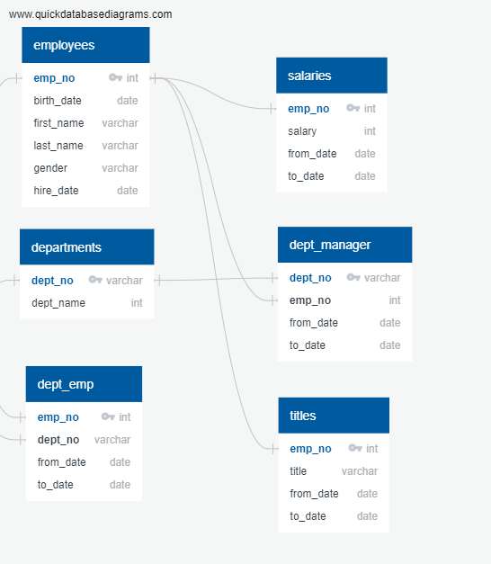
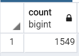

# Pewlett-Hackard-Analysis
# Module 7 challenge
### Module 7 challange queries are store in file: [module7_quries](Data/module_7_challenge.sql)
### ERD diagram with original tables

### Original table schema is store in file "Queries/table_schema.sql"
```sql
-- Creating tables for PH-EmployeeDB
CREATE TABLE departments (
     dept_no VARCHAR(4) NOT NULL,
     dept_name VARCHAR(40) NOT NULL,
     PRIMARY KEY (dept_no),
     UNIQUE (dept_name)
);

CREATE TABLE employees (
    emp_no INT NOT NULL,
    birth_date DATE NOT NULL,
	first_name VARCHAR NOT NULL,
	last_name VARCHAR NOT NULL,
	gender VARCHAR NOT NULL,
	hire_date DATE NOT NULL,
	PRIMARY KEY (emp_no)
);

CREATE TABLE dept_manager(
	dept_no VARCHAR(4) NOT NULL,
	emp_no INT NOT NULL,
	from_date DATE NOT NULL,
	to_date DATE NOT NULL,
	FOREIGN KEY (emp_no) REFERENCES employees (emp_no),
	FOREIGN KEY (dept_no) REFERENCES departments (dept_no),
	PRIMARY KEY (emp_no, dept_no)
);

CREATE TABLE salaries (
	emp_no INT NOT NULL,
	salary INT NOT NULL,
	from_date DATE NOT NULL,
	to_date DATE NOT NULL,
	FOREIGN KEY (emp_no) REFERENCES employees (emp_no),
	PRIMARY KEY (emp_no)
);

CREATE TABLE dept_emp (
	emp_no INT NOT NULL,
	dept_no VARCHAR(4) NOT NULL,
	from_date DATE NOT NULL,
	to_date DATE NOT NULL,
	FOREIGN KEY (emp_no) REFERENCES employees (emp_no),
	FOREIGN KEY (dept_no) REFERENCES departments (dept_no),
	PRIMARY KEY (emp_no, dept_no)
);

CREATE TABLE titles(
	emp_no INT NOT NULL,
	title VARCHAR NOT NULL,
	from_date DATE NOT NULL,
	to_date DATE NOT NULL,
	FOREIGN KEY (emp_no) REFERENCES employees (emp_no)
);

SELECT * FROM departments;
SELECT * FROM dept_emp;
SELECT * FROM dept_manager;
SELECT * FROM employees;
SELECT * FROM salaries;
SELECT * FROM titles;
```
### Delivering Results: Technical Report
#### Summary Results
Number of individuals retiring: 
```sql
-- number of individuals retiring
SELECT COUNT(emp_no) as count_num_ri_emp
FROM most_recent_title_per_employee;
```

number of individuals
available for mentorship role
```sql
-- number of mentors
SELECT COUNT(DISTINCT emp_no)
FROM mentorship_program;
```

#### recommendation
According to data there are multiple duplicates, needed to clean the duplicates. Maximum number of senior engineers are retireing so need to act on it.
### Technical Deliverable 1
#### Table with retiring employees (create a table containing the number of employees who are about to retire (those born 1952-1955))
csv file for the result (number_of_employees.csv): [number_of_employees](Data/number_of_employees.csv)
```sql
--create a table containing the number of employees who are about to retire (those born 1952-1955)
SELECT e.emp_no, e.first_name,
       e.last_name, ti.title,
       ti.from_date, ti.to_date, s.salary
INTO number_of_employees
FROM employees as e
INNER JOIN titles as ti
ON (e.emp_no = ti.emp_no)
INNER JOIN salaries as s
ON (ti.emp_no = s.emp_no)
WHERE (e.birth_date BETWEEN '1952-01-01' AND '1955-12-31')
ORDER BY e.emp_no;
```
#### No duplicates
CSV file created above has many duplicates. created another file without duplicate [most_recent_title_per_employee](Data/most_recent_title_per_employee.csv). Query for that is as below:
```sql
-- filter duplicates with PARTITION
SELECT  emp_no,
        first_name,
        last_name,
        title,
        to_date
INTO most_recent_title_per_employee
FROM
 ( SELECT emp_no,
        first_name,
        last_name,
        title,
        to_date, ROW_NUMBER() OVER
         (PARTITION BY (emp_no)
         ORDER BY to_date DESC) rn
         FROM number_of_employees
 ) tmp WHERE rn = 1
 ORDER BY emp_no;
```
Number of employees with each title, CSV is:  [employees_per_title](Data/retirement_ready_employees_grouped_by_title.csv)
```sql
-- total number of going to retire by per title
SELECT COUNT(title) as title_count, title
INTO employees_per_title
FROM most_recent_title_per_employee
GROUP BY title
ORDER BY title_count
;
```
### Technical Deliverable 2
#### Mentor employees will need to have a date of birth that falls between January 1, 1965 and December 31, 1965
csv for eligible mentors are:  [eligible_mentors](Data/mentorship_eligibility.csv)
```sql
SELECT e.emp_no, e.first_name,
       e.last_name, ti.title,
       de.from_date, de.to_date
INTO mentorship_program
FROM employees as e
INNER JOIN dept_emp as de
ON (e.emp_no = de.emp_no)
INNER JOIN titles as ti
ON (de.emp_no = ti.emp_no)
WHERE (e.birth_date BETWEEN '1965-01-01' AND '1965-12-31')
AND(de.to_date = '9999-01-01')
ORDER by emp_no;
```
Total number of ligible mentors are: 1549
```sql
SELECT COUNT(DISTINCT emp_no)
FROM mentorship_program;
```


